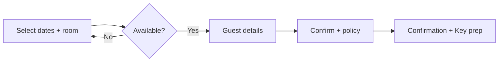
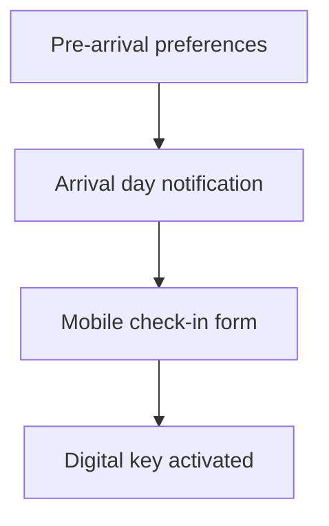
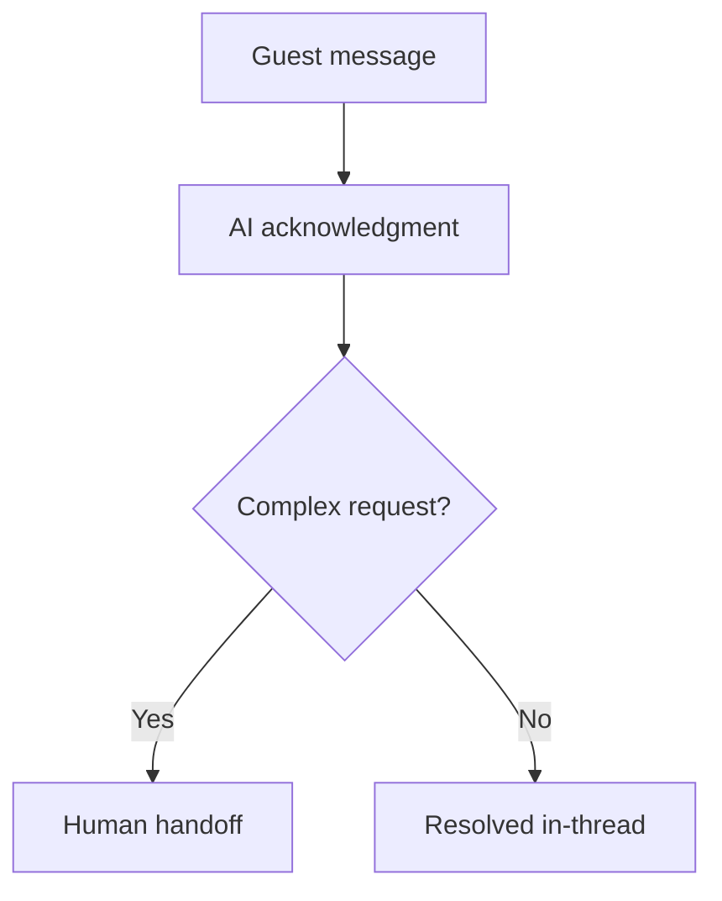

# SASALLE — UX Flows

## Booking (max 3 steps)

1. **Dates & Room** — calendar inputs, room selector, optional package & promo, live price with seasonal note
2. **Guest Details** — name, email, phone (minimal fields)
3. **Confirmation** — total, cancellation policy accordion, confirm CTA

**Rules:** No step 4. Promo validation inline. Unavailable dates block continue.

## Check-in

- Pillow, arrival time, dietary notes
- Sync to housekeeping & F&B before arrival

## Concierge (AI + human)

Quick actions: Airport transfer, In-room dining, Housekeeping

## Admin operations

Dashboard → Bookings / Rooms / CRM / Revenue / OTA channels

OTA row items marked **Ready** for Booking.com, Agoda, Traveloka webhook integration.

## Loyalty tiers

| Tier | Signal |
|------|--------|
| Silver | 1–3 stays |
| Gold | 4–9 stays |
| Black | 10+ stays |

Benefits surface on Key screen and check-in (future).
